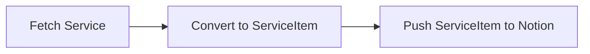

# bluenotiondb

Sync any service to Notion.

## Purpose

Notion does not support custom sync DB.
I want to create sync DB for Bluesky or Twitter etc...

`bluenotiondb` is customizable sync DB for Notion.

## Supported Services

- [Bluesky](https://bsky.app/)
    - Pull Posts from Bluesky and push to Notion
- [GitHub Search](https://github.com/search)
    - Pull Issues/PRs or Repositories from GitHub Search and push to Notion

## Usage

We have provided `bluenotiondb` as single binary for GitHub Actions's `ubuntu-latest`.

- Latest release: <https://github.com/azu/bluenotiondb/releases/latest>

You can download `bluenotiondb` and run it with the following environment variables:

- `BLUE_NOTION_ENVS`: JSON string of `Env` type

You can create `BLUE_NOTION_ENVS` on generator tool:

- <https://azu.github.io/bluenotiondb/>

### via CLI

```bash
$ BLUE_NOTION_ENVS='[...]' ./bluenotiondb
```

### via GitHub Actions

1. Create GitHub repository
2. Put `.github/workflows/update.yml` to the repository 
3. Copy from <https://github.com/azu/bluenotiondb/releases/latest> and Paste to `.github/workflows/update.yml`
4. Set `BLUE_NOTION_ENVS` to GitHub repository secret

```yaml
name: Update
on:
  push:
    branches:
      - main
  schedule:
    # every 30 minutes
    - cron: "*/30 * * * *"
  workflow_dispatch:

env:
  BLUE_NOTION_VERSION: v0.1.0 # see https://github.com/azu/bluenotiondb/releases/latest

permissions:
  contents: none
jobs:
  update:
    runs-on: ubuntu-latest
    steps:
      - name: Download
        run: |
          curl -L https://github.com/azu/bluenotiondb/releases/download/${{env.BLUE_NOTION_VERSION}}/bluenotiondb -o bluenotiondb
          chmod +x bluenotiondb
      - name: Update
        run: ./bluenotiondb
        env:
          BLUE_NOTION_ENVS: ${{ secrets.BLUE_NOTION_ENVS }}
```

## Related

- [azu/mytweets: Search all your tweets of Twitter/Bluesky](https://github.com/azu/mytweets)

## Architecture

1. Fetch posts from Service
2. Convert post to ServiceItem
3. Push ServiceItem to Notion



If you want to support a new service, you need to implement the following:

1. Add `services/<service-name>.ts`
2. Implement `fetch~` function
3. Add Env type to `notion/envs.ts`
4. Add `fetch~` to `index.ts`

## Development

To install dependencies:

```bash
bun install
```

To use local env:

1. Create `BLUE_NOTION_ENVS` env var using [bluenotiondb env generator](https://azu.github.io/bluenotiondb/)
2. Crate `.env` file and paste `BLUE_NOTION_ENVS` to `.env`

```bash
BLUE_NOTION_ENVS='[...]'
````

To run:

```bash
bun run main
```

This project was created using `bun init` in bun v0.6.0. [Bun](https://bun.sh) is a fast all-in-one JavaScript runtime.


## Debug

You can use `DEBUG` env to debug.

```bash
DEBUG=1 ./bluenotiondb
```

## Release Flow

```
npm version {patch,minor,major}
git push --follow-tags
gh release create --generate-notes "$(git describe --tags --abbrev=0)" --discussion-category "announcements"
```

## License

MIT
