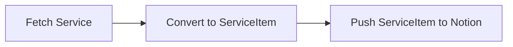

# bluenotiondb

BluenotionDB Sync any service to Notion using Cron services like GitHub Actions.

## Purpose

Notion does not support custom sync DB.
I want to create sync DB for Bluesky or Twitter etc...

`bluenotiondb` is customizable sync DB for Notion.

## Supported Services

- [Bluesky](https://bsky.app/)
    - Pull Posts from Bluesky and push to Notion
- [GitHub Activity](https://github.com/)
    - Pull events of GitHub user and push to Notion 
    - Open/Close/Comment of Issues/PRs etc...
- [GitHub Search](https://github.com/search)
    - Pull Issues/PRs or Repositories from GitHub Search and push to Notion
    - **Required**: need to setup `actions/cache` action to prevent duplicated items
- [Linear](https://linear.app/)
    - Assigned Issues, Created Issues, and Activity (comments, status changes, etc.)
    - **Required**: need to setup `actions/cache` action to prevent duplicated items
- iCal calendar like [Google Calendar](https://calendar.google.com/)
    - Pull events from iCal and push to Notion
    - **Required**: need to setup `actions/cache` action to prevent duplicated items
- RSS Feeds
    - Pull posts from RSS Feeds and push to Notion
    - **Required**: need to setup `actions/cache` action to prevent duplicated items

## Usage

## Setup Notion

1. Duplicate [This Notion Template](https://efcl.notion.site/Demo-Bluenotion-0f9885a393874c2aa7a4765ff5ddf0be)
2. Create Notion Integration
    - <https://www.notion.so/my-integrations>
    - Copy the API key
    - Also, You need to install the integration to your Notion Database
3. Create `BLUENOTION_ENVS` env var using [bluenotiondb env generator](https://azu.github.io/bluenotiondb/)
    - <https://azu.github.io/bluenotiondb/>

### via CLI

```bash
$ BLUENOTION_ENVS='[...]' ./bluenotiondb
```

### via GitHub Actions

1. Create GitHub repository
2. Put `.github/workflows/update.yml` to the repository
3. Copy from <https://github.com/azu/bluenotiondb/releases/latest> and Paste to `.github/workflows/update.yml`
4. Set `BLUENOTION_ENVS` to GitHub repository secret

```yaml
name: Update
on:
  push:
    branches:
      - main
  schedule:
    # every 30 minutes
    - cron: "*/30 * * * *"
  workflow_dispatch:

env:
  BLUENOTION_VERSION: v2.2.0

permissions:
  contents: none
jobs:
  update:
    runs-on: ubuntu-latest
    steps:
      - name: Download
        run: |
          curl -L https://github.com/azu/bluenotiondb/releases/download/${{env.BLUENOTION_VERSION}}/bluenotiondb -o bluenotiondb
          chmod +x bluenotiondb
      - name: Update
        run: ./bluenotiondb > /dev/null 2>&1
        env:
          BLUENOTION_ENVS: ${{ secrets.BLUENOTION_ENVS }}
```

## Advanced Usage

### Add custom field

- `notion_property_names` option is used for custom property name

You can change the property name by `notion_property_names` option.

- `Title`: title column
- `URL`: URL type column
- `Type`: Select type column
- `Date`: Date type column
- `Parent`: Parent type column
  - Enable "Sub Item" in Notion
  - It will be used for reply representation

For example, if you want to change `Title` to `Tasks` and `URL` to `url`, you can use `notion_property_names` option.

```
[..., "notion_property_names":{ "Title": "Tasks", "URL": "url" }]
```

- `notion_extra` field is an object like `{ propertyNames: propertyValue }`
    - `propertyNames` is property name
    - `propertyValue` is [notion payload](https://developers.notion.com/reference/property-object)

For example, if you want to add `Tags` column to Notion, you can use `notion_extra` option.

```
[..., "notion_extra":{ "Tags": { "multi_select": [{ "name": "TEST" }] }}]
```


Limitation: Currently does not put non-Ascii characters to `.env`.
You can use unicode escape sequence like `\u30bf\u30b9\u30af\u540d` instead of non-Ascii characters.

- [Unicodeエスケープシーケンス変換｜コードをホームページに載せる時に便利 | すぐに使える便利なWEBツール | Tech-Unlimited](https://tech-unlimited.com/escape-unicode.html).

## Recipe

### Sync Google Calendar to Notion

1. Copy your iCal URL from Google Calendar
2. Create `BLUENOTION_ENVS` env var using [bluenotiondb env generator](https://azu.github.io/bluenotiondb/)
    - <https://azu.github.io/bluenotiondb/>
3. Create Update Calendar workflow

```yaml
name: Update Calendar
on:
  schedule:
    # every 12 hours
    - cron: "0 */12 * * *"
  workflow_dispatch:
env:
  BLUENOTION_VERSION: v2.2.0

permissions:
  contents: read
  actions: write # require to delete cache
jobs:
  calendar:
    runs-on: ubuntu-latest
    env:
      cache-name: cache-bluenotion-calendar
    steps:
      # actions/cache does not support overwrite cache
      # https://github.com/actions/cache/issues/342
      # This job implement overwrite cache using restore + delete + save
      - name: Checkout
        uses: actions/checkout@v3 # gh command require repository
      - name: Restore Cache
        id: cache-restore
        uses: actions/cache/restore@v3
        with:
          path: ./cache
          key: ${{ env.cache-name }}
      - name: Download
        run: |
          curl -L https://github.com/azu/bluenotiondb/releases/download/${{env.BLUENOTION_VERSION}}/bluenotiondb -o bluenotiondb
          chmod +x bluenotiondb
      - name: Update
        run: ./bluenotiondb  > /dev/null 2>&1
        env:
          CACHE_DIR: ./cache
          BLUE_NOTION_ENVS: ${{ secrets.BLUE_NOTION_ENVS }}
      # overwrite cache key
      - name: Delete Previous Cache
        if: ${{ steps.cache-restore.outputs.cache-hit }}
        continue-on-error: true
        run: |
          gh extension install actions/gh-actions-cache
          gh actions-cache delete "${{ env.cache-name }}" --confirm
        env:
          GH_TOKEN: ${{ secrets.GITHUB_TOKEN }}
      - name: Save Cache
        uses: actions/cache/save@v3
        with:
          path: ./cache
          key: ${{ env.cache-name }}
```

### Sync GitHub Search Results to Notion

1. Create `BLUENOTION_ENVS` env var using [bluenotiondb env generator](https://azu.github.io/bluenotiondb/)
    - e.g. Fetch your assigned Issue and PR
      - Query: `assignee:@me state:open`
      - Type: `Issues`
2. Create Update GitHub Search workflow

```yaml
name: Update GitHub Search
on:
  schedule:
    # every hour
    - cron: "0 * * * *"
  workflow_dispatch:
env:
  BLUENOTION_VERSION: v2.2.0

permissions:
  contents: read
  actions: write # require to delete cache
jobs:
  github-search:
    runs-on: ubuntu-latest
    env:
      cache-name: cache-bluenotion-github-search
    steps:
      # actions/cache does not support overwrite cache
      # https://github.com/actions/cache/issues/342
      # This job implement overwrite cache using restore + delete + save
      - name: Checkout
        uses: actions/checkout@v3
      - name: Restore Cache
        id: cache-restore
        uses: actions/cache/restore@v3
        with:
          path: ./cache
          key: ${{ env.cache-name }}
      - name: Download
        run: |
          curl -L https://github.com/azu/bluenotiondb/releases/download/${{env.BLUENOTION_VERSION}}/bluenotiondb -o bluenotiondb
          chmod +x bluenotiondb
      - name: Update
        run: ./bluenotiondb  > /dev/null 2>&1
        env:
          CACHE_DIR: ./cache
          BLUE_NOTION_ENVS: ${{ secrets.BLUE_NOTION_ENVS }}
      # overwrite cache key
      - name: Delete Previous Cache
        if: ${{ steps.cache-restore.outputs.cache-hit }}
        continue-on-error: true
        run: |
          gh extension install actions/gh-actions-cache
          gh actions-cache delete "${{ env.cache-name }}" --confirm
        env:
          GH_TOKEN: ${{ secrets.GITHUB_TOKEN }}
      - name: Save Cache
        uses: actions/cache/save@v3
        with:
          path: ./cache
          key: ${{ env.cache-name }}
```

### Overwrite `type` column

If you want to overwrite built-in `type` column, you can use `notion_extra` option.

```bash
BLUENOTION_ENVS='[{"notion_database_id":"xxx","notion_api_key":"xxx","rss_url":"https://rsshub.app/github/repos/azu","notion_extra":{"Type":{"select":{"name":"My GitHub Repository"}}}}]'
```

## Related

- [azu/mytweets: Search all your tweets of Twitter/Bluesky](https://github.com/azu/mytweets)

## Architecture

1. Fetch posts from Service
2. Convert post to ServiceItem
3. Push ServiceItem to Notion



If you want to support a new service, you need to implement the following:

1. Add `services/<service-name>.ts`
2. Implement `fetch~` function
3. Add Env type to `notion/envs.ts`
4. Add `fetch~` to `index.ts`

## Cache

If future date will be added, this service should be cached.
Otherwise, dedupe events by using last updated date.

## Development

To install dependencies:

```bash
bun install
```

To use local env:

1. Create `BLUENOTION_ENVS` env var using [bluenotiondb env generator](https://azu.github.io/bluenotiondb/)
2. Crate `.env` file and paste `BLUENOTION_ENVS` to `.env`

```bash
BLUENOTION_ENVS='[...]'
````

To run:

```bash
bun run main
```

This project was created using `bun init` in bun v0.6.0. [Bun](https://bun.sh) is a fast all-in-one JavaScript runtime.

## Debug

You can use `DEBUG` env to debug.

```bash
DEBUG=1 ./bluenotiondb
```

## Release Flow

```
npm version {patch,minor,major}
npm run sync-version
git push --follow-tags
```

## License

MIT
