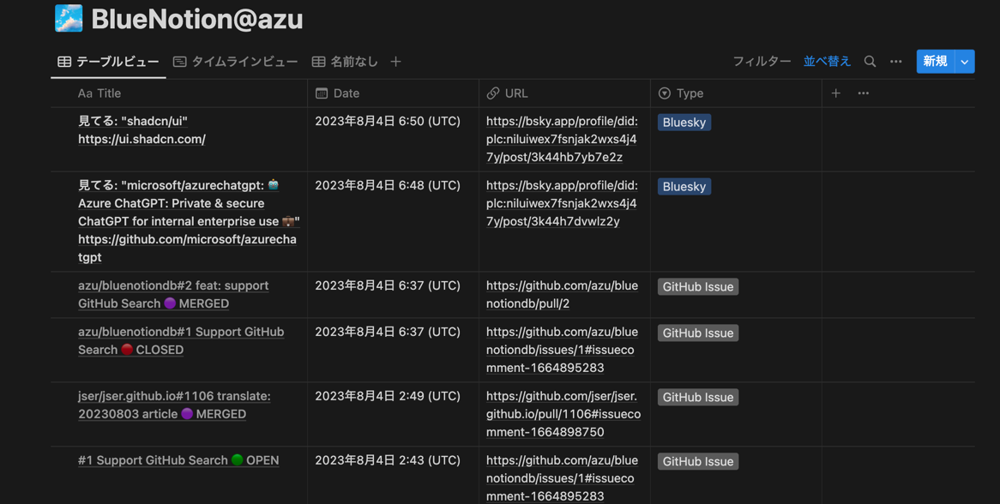
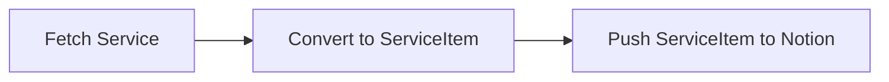

# bluenotiondb

Sync any service to Notion.

## Purpose

Notion does not support custom sync DB.
I want to create sync DB for Bluesky or Twitter etc...

`bluenotiondb` is customizable sync DB for Notion.

## Supported Services

- [Bluesky](https://bsky.app/)
    - Pull Posts from Bluesky and push to Notion
- [GitHub Activity](https://github.com/)
    - Pull events of GitHub user and push to Notion 
    - Open/Close/Comment of Issues/PRs etc...
- [GitHub Search](https://github.com/search)
    - Pull Issues/PRs or Repositories from GitHub Search and push to Notion

## Usage

## Setup Notion

1. Create Notion Database
2. Add following Properties with type
    - `Title`: title column
    - `Date`: Date type column
        - Also, It should enable "Time"
    - `URL`: URL type column
    - `Type`: Select type column
        - Type will be service name
    - 
    - Note: You can change the property name by `notion_property_names` option
3. Create Notion Integration
    - <https://www.notion.so/my-integrations>
4. Create `BLUE_NOTION_ENVS` env var using [bluenotiondb env generator](https://azu.github.io/bluenotiondb/)
    - <https://azu.github.io/bluenotiondb/>

### via CLI

```bash
$ BLUE_NOTION_ENVS='[...]' ./bluenotiondb
```

### via GitHub Actions

1. Create GitHub repository
2. Put `.github/workflows/update.yml` to the repository
3. Copy from <https://github.com/azu/bluenotiondb/releases/latest> and Paste to `.github/workflows/update.yml`
4. Set `BLUE_NOTION_ENVS` to GitHub repository secret

```yaml
name: Update
on:
  push:
    branches:
      - main
  schedule:
    # every 30 minutes
    - cron: "*/30 * * * *"
  workflow_dispatch:

env:
  BLUE_NOTION_VERSION: v0.6.2

permissions:
  contents: none
jobs:
  update:
    runs-on: ubuntu-latest
    steps:
      - name: Download
        run: |
          curl -L https://github.com/azu/bluenotiondb/releases/download/${{env.BLUE_NOTION_VERSION}}/bluenotiondb -o bluenotiondb
          chmod +x bluenotiondb
      - name: Update
        run: ./bluenotiondb
        env:
          BLUE_NOTION_ENVS: ${{ secrets.BLUE_NOTION_ENVS }}
```

## Advanced Usage

### Add custom field

- `notion_property_names` option is used for custom property name

You can change the property name by `notion_property_names` option.

- `Title`: title column
- `URL`: URL type column
- `Type`: Select type column
- `Date`: Date type column

For example, if you want to change `Title` to `Tasks` and `URL` to `url`, you can use `notion_property_names` option.

```
[..., "notion_property_names":{ "Title": "Tasks", "URL": "url" }]
```

- `notion_extra` field is an object like `{ propertyNames: propertyValue }`
    - `propertyNames` is property name
    - `propertyValue` is [notion payload](https://developers.notion.com/reference/property-object)

For example, if you want to add `Tags` column to Notion, you can use `notion_extra` option.

```
[..., "notion_extra":{ "Tags": { "multi_select": [{ "name": "TEST" }] }} ]
```

## Related

- [azu/mytweets: Search all your tweets of Twitter/Bluesky](https://github.com/azu/mytweets)

## Architecture

1. Fetch posts from Service
2. Convert post to ServiceItem
3. Push ServiceItem to Notion



If you want to support a new service, you need to implement the following:

1. Add `services/<service-name>.ts`
2. Implement `fetch~` function
3. Add Env type to `notion/envs.ts`
4. Add `fetch~` to `index.ts`

## Development

To install dependencies:

```bash
bun install
```

To use local env:

1. Create `BLUE_NOTION_ENVS` env var using [bluenotiondb env generator](https://azu.github.io/bluenotiondb/)
2. Crate `.env` file and paste `BLUE_NOTION_ENVS` to `.env`

```bash
BLUE_NOTION_ENVS='[...]'
````

To run:

```bash
bun run main
```

This project was created using `bun init` in bun v0.6.0. [Bun](https://bun.sh) is a fast all-in-one JavaScript runtime.

## Debug

You can use `DEBUG` env to debug.

```bash
DEBUG=1 ./bluenotiondb
```

## Release Flow

```
npm version {patch,minor,major}
npm run sync-version
git push --follow-tags
```

## License

MIT
