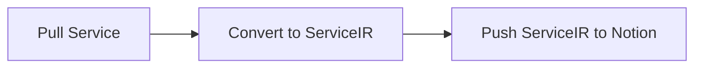

# bluenotiondb

Sync any service to Notion.

## Architecture

1. Pull Service
2. Convert to ServiceIR
3. Push ServiceIR to Notion



If you want to support a new service, you need to implement the following:

1. Add `services/<service-name>.ts`
2. Implement `fetch~` function
3. Add Env type to `notion/envs.ts`
4. Add `fetch~` to `index.ts`

## Supported Services

- [Bluesky](https://bsky.app/)

## Development

To install dependencies:

```bash
bun install
```

To run:

```bash
bun run index.ts
```

This project was created using `bun init` in bun v0.6.0. [Bun](https://bun.sh) is a fast all-in-one JavaScript runtime.
