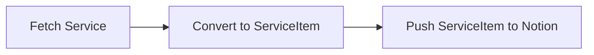

# bluenotiondb

Sync any service to Notion.

## Supported Services

- [Bluesky](https://bsky.app/)

## Usage

We have provided `bluenotiondb` as single binary.

- Latest release: <https://github.com/azu/bluenotiondb/releases/latest>

You can download `bluenotiondb` and run it with the following environment variables:

- `BLUE_NOTION_ENVS`: JSON string of `Env` type

You can create `BLUE_NOTION_ENVS` on generator tool:

- <https://azu.github.io/bluenotiondb/>

### via GitHub Actions

1. Create GitHub repository
2. Put `.github/workflows/update.yml` to the repository
3. Set `BLUE_NOTION_ENVS` to GitHub repository secret

```yaml
name: Update
on:
  schedule:
    # every 30 minutes
    - cron: "*/30 * * * *"
  workflow_dispatch:
env:
  BLUE_NOTION_VERSION: v0.1.0

permissions:
  contents: read
jobs:
  update:
    runs-on: ubuntu-latest
    steps:
      - name: Download
        run: |
          curl -L https://github.com/azu/bluenotiondb/releases/download/${{env.BLUE_NOTION_VERSION}}/bluenotiondb -o bluenotiondb
          chmod +x bluenotiondb
      - name: Update
        run: ./bluenotiondb
        env:
          BLUE_NOTION_ENVS: ${{ secrets.BLUE_NOTION_ENVS }}
```

## Architecture

1. Fetch posts from Service
2. Convert post to ServiceItem
3. Push ServiceItem to Notion



If you want to support a new service, you need to implement the following:

1. Add `services/<service-name>.ts`
2. Implement `fetch~` function
3. Add Env type to `notion/envs.ts`
4. Add `fetch~` to `index.ts`

## Development

To install dependencies:

```bash
bun install
```

To run:

```bash
bun run index.ts
```

This project was created using `bun init` in bun v0.6.0. [Bun](https://bun.sh) is a fast all-in-one JavaScript runtime.

## Release Flow

```
npm version {patch,minor,major}
git push --follow-tags
```
